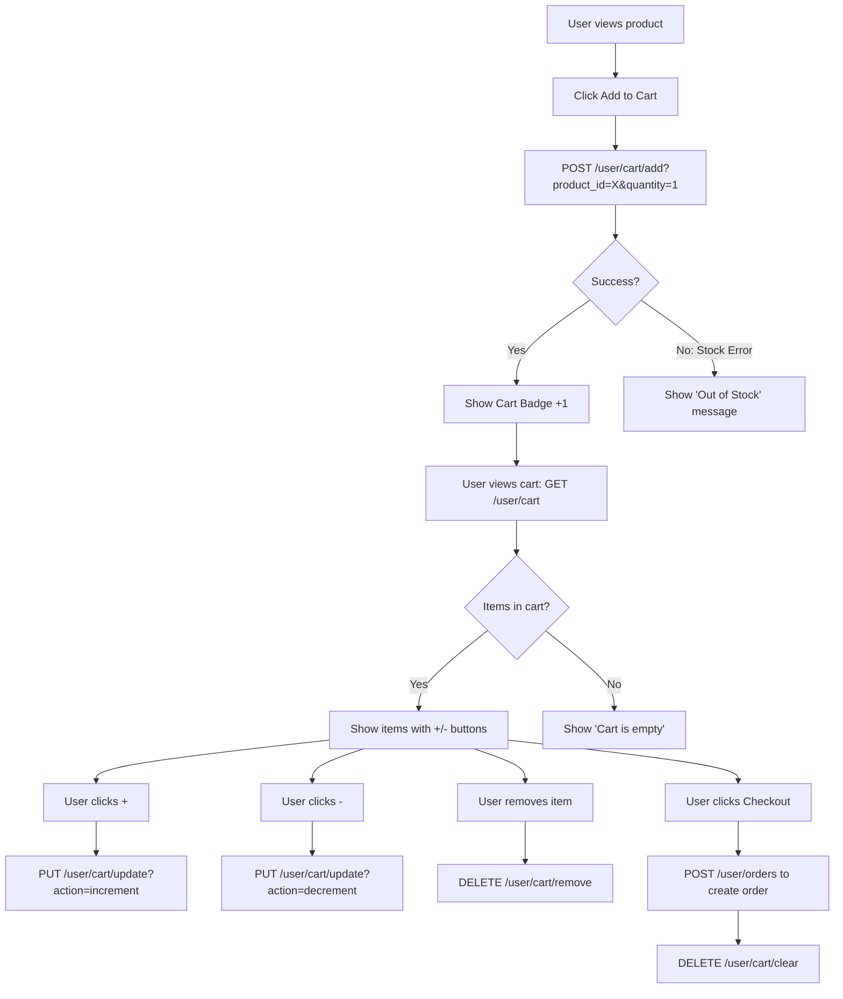

# Cart Integration Guide

This guide covers all cart-related API endpoints for building the shopping cart experience in the Gabaa Mini App.

---

## Authentication
All cart endpoints require a valid JWT token in the `Authorization` header:
```
Authorization: Bearer <your_token>
```

The `user_id` is automatically extracted from the token — no need to pass it in the request.

---

## 1. Get Cart
Fetch the current user's cart with full product details and a computed total price.

**Endpoint:** `GET /user/cart`

**Response:**
```json
{
  "success": true,
  "data": {
    "items": [
      {
        "product": {
          "id": 1,
          "store_id": 2,
          "name": "Vintage Leather Bag",
          "description": "Handcrafted genuine leather bag.",
          "price": 2500.00,
          "stock": 10,
          "category": "Fashion",
          "images": ["https://res.cloudinary.com/.../image1.jpg"],
          "status": "published"
        },
        "quantity": 2
      }
    ],
    "total_price": 5000.00
  },
  "error": null
}
```

> **Note:** `items` will be an empty array `[]` if the cart is empty.

---

## 2. Add Item to Cart
Add a product to the cart or update its quantity if it already exists. Performs a **stock validation** automatically.

**Endpoint:** `POST /user/cart/add`

**Query Parameters:**
| Param | Type | Required | Description |
| :--- | :--- | :--- | :--- |
| `product_id` | integer | Yes | The ID of the product to add. |
| `quantity` | integer | Yes | The desired quantity. Must be ≤ available stock. |

**Example:** `POST /user/cart/add?product_id=1&quantity=2`

**Success Response:**
```json
{
  "success": true,
  "data": { "message": "added to cart" },
  "error": null
}
```

**Error — Insufficient Stock (422):**
```json
{
  "success": false,
  "data": null,
  "error": "insufficient stock for product 1"
}
```

---

## 3. Update Cart Item Quantity
Increment or decrement the quantity of an item already in the cart. If quantity drops to `0`, the item is **automatically removed**.

**Endpoint:** `PUT /user/cart/update`

**Query Parameters:**
| Param | Type | Required | Values |
| :--- | :--- | :--- | :--- |
| `product_id` | integer | Yes | ID of the cart item. |
| `action` | string | Yes | `increment` or `decrement` |

**Examples:**
- `PUT /user/cart/update?product_id=1&action=increment`
- `PUT /user/cart/update?product_id=1&action=decrement`

**Success Response:**
```json
{
  "success": true,
  "data": { "message": "cart item updated" },
  "error": null
}
```

---

## 4. Remove Item from Cart
Completely remove a single item from the cart.

**Endpoint:** `DELETE /user/cart/remove`

**Query Parameters:**
| Param | Type | Required | Description |
| :--- | :--- | :--- | :--- |
| `product_id` | integer | Yes | ID of the product to remove. |

**Example:** `DELETE /user/cart/remove?product_id=1`

**Success Response:**
```json
{
  "success": true,
  "data": { "message": "item removed from cart" },
  "error": null
}
```

---

## 5. Clear Cart
Remove **all items** from the cart at once (e.g., after a successful checkout).

**Endpoint:** `DELETE /user/cart/clear`

**Success Response:**
```json
{
  "success": true,
  "data": { "message": "cart cleared" },
  "error": null
}
```

---

## 6. Recommended Implementation Flow



---

## 7. Integration Checklist
- [ ] Fetch cart on app load (`GET /user/cart`) and show badge count in the header.
- [ ] Validate that the user is authenticated before showing Add to Cart button.
- [ ] Use `increment`/`decrement` actions for `+/-` buttons (no custom quantity input needed).
- [ ] After a successful `POST /user/orders`, call `DELETE /user/cart/clear` to reset the cart.
- [ ] Handle `insufficient stock` errors gracefully in the UI.
