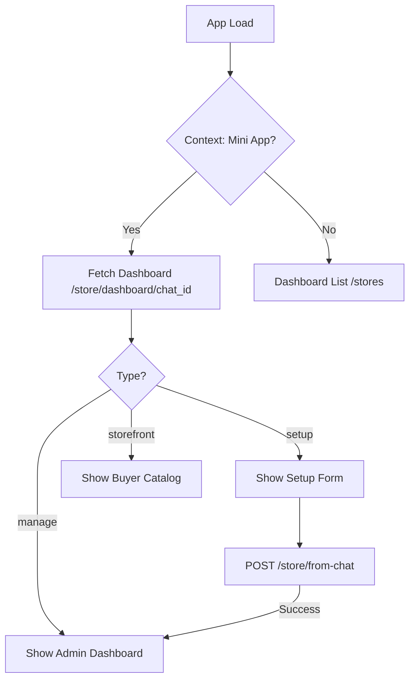

## 1. Important: Distinguishing between IDs

To avoid "Record Not Found" or "Chat Not Found" errors, the frontend must distinguish between two types of IDs:

- **`userId` (Internal DB ID)**: Used only for internal references. e.g., `2`.
- **`telegramUserId` (Telegram ID)**: Used for all bot and chat-related API calls. e.g., `635492226`.

**Always use `telegramUserId` when calling `/store/dashboard/:chat_id` or setting the `telegram_chat_id` in a store request.**

---

## 2. Initial State Check

When the app loads, you must determine if the current user/chat context requires a store setup or management view.

**Request:**
`GET /store/dashboard/{chat_id}`

**Response Cases:**

| `dashboard_type` | View to Display | Action Required |
| :--- | :--- | :--- |
| `setup` | **Setup Form** | Show a "Create Your Store" form. |
| `manage` | **Admin Dashboard** | Show product management and store settings. |
| `storefront` | **Customer View** | Show product listing for buyers. |

---

## 2. Implementing the Setup Form

The Setup Form should be displayed when `dashboard_type === "setup"`.

### Form Fields & Validation
| Field | Type | Required | Notes |
| :--- | :--- | :--- | :--- |
| `name` | String | Yes | Name of the shop. |
| `category` | String | Yes | Primary category (e.g., Electronics). |
| `phone` | String | Yes | Format: +251... |
| `email` | String | Yes | Valid email address. |
| `description` | String | No | Max 500 characters. |
| `location` | String | No | City or Address. |

### Submitting the Setup
**Endpoint:** `POST /store/from-chat`

**Payload Example:**
```json
{
  "telegram_chat_id": 635492226, // Use telegramUserId (NOT internal userId)
  "name": "My New Store",
  "category": "Fashion",
  "description": "Trendy clothes for everyone",
  "phone": "+251911223344",
  "email": "contact@shop.com",
  "location": "Addis Ababa"
}
```

---

## 3. The "Connect to Bot" Flow (Silent Linking)

If a merchant is on the **Web Dashboard** and wants to link their store to a Telegram group, they need to initialize their session with the bot.

### Step 1: Generate Deep Link
Create a button that opens the bot with the store ID as a payload:
`https://t.me/{bot_username}?start=link_store_{store_id}`

### Step 2: Instruction Modal
When the user clicks the button, show a modal with these instructions:
1. "Click 'Start' in the private chat with the bot."
2. "Add the bot to your Telegram Group or Channel."
3. "Make the bot an **Administrator**."
4. "The bot will silently link your store and send you a private confirmation."

---

## 4. UI Best Practices

1.  **Context Detection**: If `window.Telegram.WebApp.initData` is available, automatically grab the `chat_id` and use it for the dashboard check.
2.  **Loading States**: Show a skeleton or spinner while `GET /store/dashboard/:chat_id` is resolving.
3.  **Success Feedback**: After `POST /store/from-chat` succeeds, show a success toast and then refresh the state to transition from `setup` to `manage`.
4.  **Admin Rights**: If the API returns a `403 Forbidden`, inform the user that they must be an administrator of the chat to set up a store.

---

## 5. Summary Flow Diagram (Frontend)


